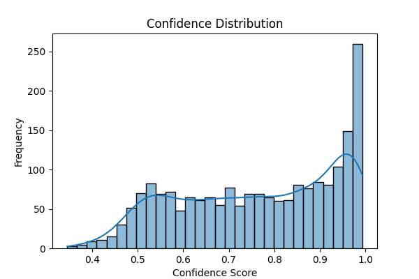
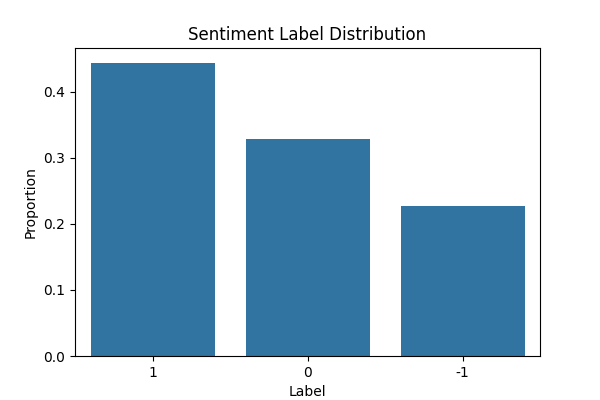
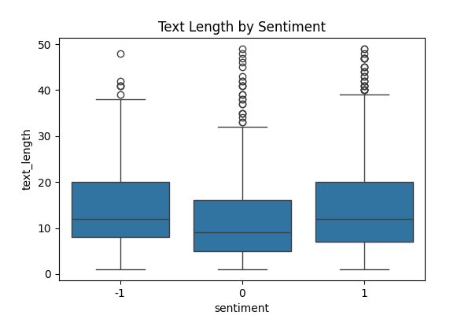
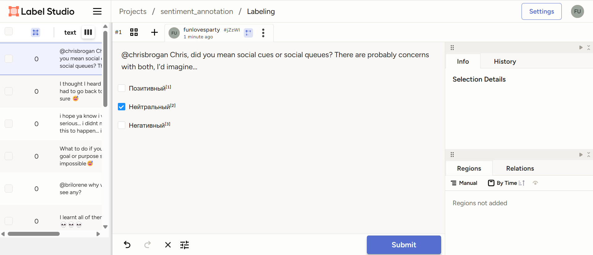
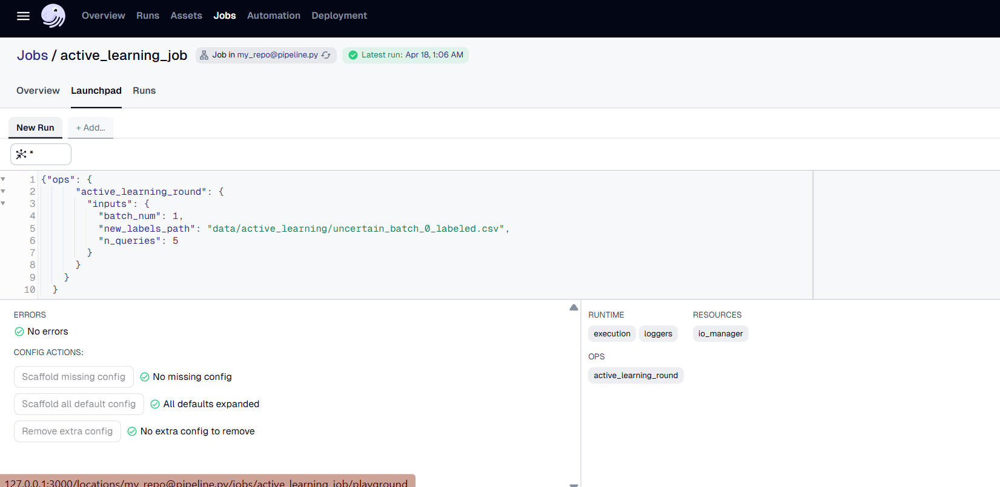

# Sentiment Analysis Project - Module 3 and 4 + Final Project: Data Annotation, Active Learning, and Dagster Pipeline

This repository contains the data and code for the **Sentiment Analysis** project, which includes the ingestion, preprocessing, annotation of data for training sentiment models and active learning.

## Project Overview

### Key Stages:
1. **Data Ingestion**: 
   - Retrieve video IDs from YouTube using `scrapetube` package.
   - Download YouTube comments using the `youtube_comment_downloader` package.
   - Download tweets from Kaggle dataset using `gdown`.
   
2. **Data Preprocessing**:
   - Perform anomaly pre-cleaning using **Isolation Forest** algorithm on sentence embeddings.
   - Annotate data using `AutoModelForSequenceClassification` from **Hugging Face Transformers**.
   
3. **Complexity Analysis**:
   - Evaluate dataset complexity and generate corresponding graphs and conclusions.

4. **Manual Annotation**:
   - A sample of 200 data points is annotated using **LabelStudio** based on predefined instructions.

5. **Active Learning**:
   - Identify and label the most uncertain samples through active learning strategies, improving the model's performance by iteratively annotating the most uncertain data.

### Tools and Technologies
- **Dagster**: For managing the entire workflow using assets and jobs.
- **Hugging Face Transformers**: For automatic text annotation using pre-trained models.
- **LabelStudio**: For manual annotation.
- **Parquet format**: For saving all raw and some processed data.

## Primary Data Annotation

### Automatic Annotation:
- A sample of ~2000 data points (out of ~20000) is automatically annotated using a model from Hugging Face's `AutoModelForSequenceClassification`.
- The data is classified into **positive**, **negative**, and **neutral** sentiments.

### Complexity Evaluation:
- 0.6 confidence threshold is selected for manual annotation based on the uncertainty. 
- Statistics are automatically calculated along with the report (see complexity_analysis/complexity_report.txt):

**Complexity Analysis Report**

📌 Shannon Entropy of Labels: 1.5334

📌 Mutual Information (Text Length ↔ Sentiment): 0.0497

📌 Percentage of Uncertain Predictions (confidence < 0.6): 22.65%

✅ Saved 1547 confident → data/auto_annotated_confident.parquet

⚠️ Saved **453** uncertain → data/auto_annotated_non_confident.parquet





As a result, **453 records have been selected for manual annotation. However, from the respect to the annotator, in terms of the project I randomly downsampled it to ~200**.

### Manual Annotation:
- The annotation process was kindly carried out by my classmate using **LabelStudio**. The process is described in the instruction folder (please proceed)
- The result is provided in the manual_annotation folder.




Feedback from the annotator:
"The sentiment analysis task was straightforward, with clear instructions. However, the dataset included several edge cases and several junk records such as strings of random letters that stood out. It might be useful to take a step back and check the data for quality and consistency for the author."

### 🧹 Data Preprocessing

This step handles merging annotations (automatic and manual), cleaning raw text, and preparing it for further NLP processing.

- We clean the text by removing:
  - URLs
  - Mentions (@usernames)
  - Time formats (e.g., 12:34)
  - Numbers and punctuation
  - Emojis and non-ASCII characters
- Filter out texts without any English alphabet characters.
- Apply **spaCy** preprocessing:
  - Tokenization
  - Stopword removal
  - Lemmatization
- The cleaned and labeled data is saved in **Parquet** format at `data/cleaned_data.parquet`.

## 🔁 Active Learning

To make the annotation process more efficient, this project incorporates **Active Learning** to prioritize labeling the most informative data points—those where the model is most uncertain. This helps improve model performance while minimizing the amount of manual annotation required.

🔍 How It Works:

1. **Initial Setup**:
   - The cleaned dataset (`data/cleaned_data.parquet`) contains both labeled and unlabeled samples.
   - Sentiment labels (`Positive`, `Neutral`, `Negative`) are encoded using `LabelEncoder` for model training.

2. **Vectorization**:
   - Text is transformed using **TF-IDF vectorization** (`ngram_range=(1,2)`, `max_features=1000`) to represent samples numerically.

3. **Model Training**:
   - A baseline **Logistic Regression** model is trained on the available labeled data.

4. **Uncertainty Sampling**:
   - The model is wrapped in a **modAL ActiveLearner** with `uncertainty_sampling` strategy.
   - The model queries the top *N* most uncertain samples (default: `200`) from the unlabeled pool.

5. **Output**:
   - Queried samples are saved to `data/active_learning/uncertain_batch_<batch_num>.csv` for manual annotation.
   - The remaining unlabeled data is updated and stored in `data/active_learning/unlabeled_data.csv`.

6. **Iterative Loop**:
   - Once annotators label the uncertain samples (saved as `uncertain_batch_X_labeled.csv`), these are merged back with previously labeled data.
   - The updated labeled dataset is used to repeat the active learning cycle.

### 📁 File Outputs:
- `uncertain_batch_X.csv`: Most uncertain samples selected for labeling.
- `uncertain_batch_X_labeled.csv`: Labeled version of the queried batch (after manual annotation).
- `labeled_data.csv`: All labeled data accumulated across rounds.
- `unlabeled_data.csv`: Remaining data pool for future querying.

This setup allows to **gradually improve the sentiment model** with the most valuable new labels, instead of labeling the full dataset blindly.

---

## Dagster Workflow

The dagster UI can be opened from the root via 
```
dagster dev -f dags/pipeline.py
```

All 4 modules from the data retrieval to active learning are wrapped in the DAG. 
The first three modules are assets which can be materialized:


Preprocessing step happens after the manual annotation step, therefore, it is separated.

The last module is wrapped in OP and JOB and can be manually triggered each round of the annotation, but the configuration file should be provided beforehand in the CLI or UI Launchpad:



- batch_num is the active learning step (provide 0 for the very first one)

- new_labels_path is the path to the manually labeled file (for the first run, provide any, it is not used)

- n_queries is the number of records to select for manual annotation

## How to Run

### Requirements:
1. Python 3.x
2. Required packages can be installed via conda with the provided `environment.yaml`.

### Running the Pipeline:
1. Install the required dependencies.
2. Run the Dagster pipeline using the following command:
   ```bash
   dagster dev -f dags/pipeline.py
   ```
3. Materialize the assets and run the job.

## Thanks for your time!