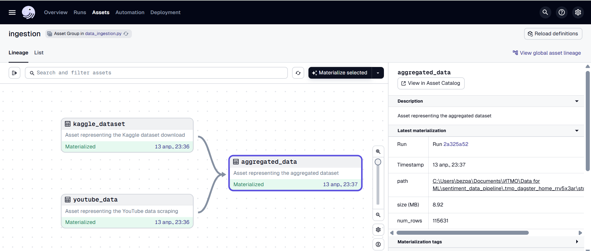

# Data for ML Project "Sentiment Analysis" - Module 1: 

This repository contains the first module of the **Data for ML** project, which focuses on **sentiment analysis**. The project leverages a labeled Kaggle dataset of tweets and YouTube comment data parsed from the YouTube platform.

### **Installation**

Clone the repository and create conda env using environment.yml file.

### **YouTube Comment Parsing**

For the YouTube comment dataset, **70 random search topics** were generated using **ChatGPT**. For each topic, the following data was collected from the top 10 most popular videos:
- **Top 70 recent comments**
- **Top 70 popular comments**

The comments were retrieved using existing YouTube scraping libraries. Note that this dataset is **unlabeled**, so the sentiment of the comments has not been pre-assigned.

### **Datasets Overview**

- **Kaggle Tweets Dataset**: Labeled sentiment data from Kaggle.
- **YouTube Comments Dataset**: Unlabeled sentiment data scraped based on generated topics.

### **Data Preprocessing & Aggregation**

- **YouTube Comments Filtering**: To match the distribution of the tweets, YouTube comments were filtered by length (comments with less than 50 words).
- **Downsampling**: The Kaggle tweet dataset was downsampled to match the size of the YouTube data.
- **Data Aggregation**: Both datasets were aggregated into a single dataframe containing only two columns:
  - `text` (comment or tweet content)
  - `sentiment` (sentiment label, where 0 = negative, 1 = positive, NaN for youtube dataset)

### **Exploratory Data Analysis (EDA)**

Exploratory data analysis (EDA) for both datasets is available in the Jupyter notebook:
```
notebooks/EDA.ipynb
```

This notebook provides insights into the characteristics of the datasets, including distributions, word clouds, and basic statistical analysis.

### **Running the Dagster Pipeline**

The entire data processing pipeline is wrapped in **Dagster**. To run the Dagster pipeline for data ingestion, you can use the following command from the **root directory**:

```bash
dagster dev -f dags/data_ingestion.py
```

Navigate to the localhost and, if needed, materialize the process. If youtube dataset already exists, it will not be scrapped again. However, you can modify this in the dags/data_ingestion.py in the respective function. 

Below is the example screenshot of the process.


