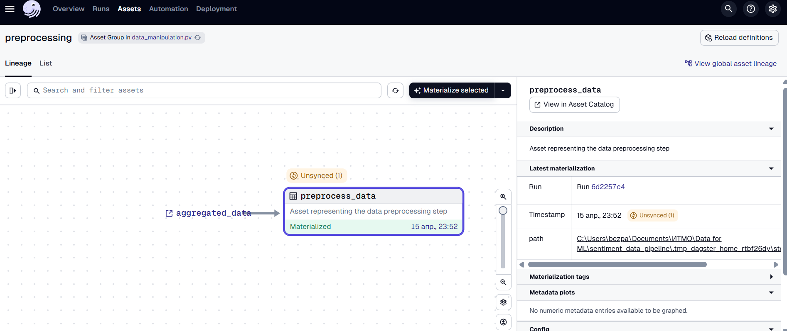

# Data for ML Project "Sentiment Analysis" - Module 2: Data Pre-processing

This project is focused on the data pre-processing phase for a sentiment analysis task. The goal is to clean and prepare the data for downstream tasks such as sentiment classification.

## Pre-processing Steps

1. **Removing Duplicates:**
   - Duplicates from the original YouTube parsed dataset have been removed to ensure that only unique records are included.

2. **Cleaning texts:**
   - **Nicknames & Mentions:** All @mentions and nicknames were removed from the tweets.
   - **Numbers:** All numbers were removed.
   - **Links:** URLs (both `http` and `https` as well as `www`) were removed from the tweets.
   - **Punctuation & Emojis:** All punctuation and emojis were stripped from the text.

3. **Removing Non-English Texts:**
   - Texts that were not in English were removed from the dataset. However, there was an issue with comments written in non-English languages but using Latin letters. Visual inspection didn't reveal many such instances, so it's assumed that these will be mostly addressed when filtering out the rarest words in the dataset with the help of max_df and min_df in TFIDF.

4. **Dataset Size:**
   - After pre-processing, the final dataset has 113,089 entries, compared to the original 115,631. This reduction is mainly due to the removal of duplicates and non-English content.

5. **Integration with Dagster:**
   - The `preprocess_data` asset was added to the Dagster pipeline. A new node for this step can be seen in the DAG.

6. **Next Steps:**
   - After pre-processing, the cleaned data is ready to be sent to the tokenizer and / or vectorizer.

## Sentiment Analysis Pre-processing

- The text data has been pre-processed specifically for the sentiment analysis task by:
  - **Removing stop-words** to focus on the more meaningful content.
  - **Lemmatization** to reduce words to their root form, ensuring uniformity in text representation.
  - These operations were performed using the `spaCy` library.

## Conclusion

With this cleaned and processed dataset, the sentiment analysis model can now be trained on well-prepared data. The pre-processing steps have removed irrelevant noise and standardized the text for optimal model performance.